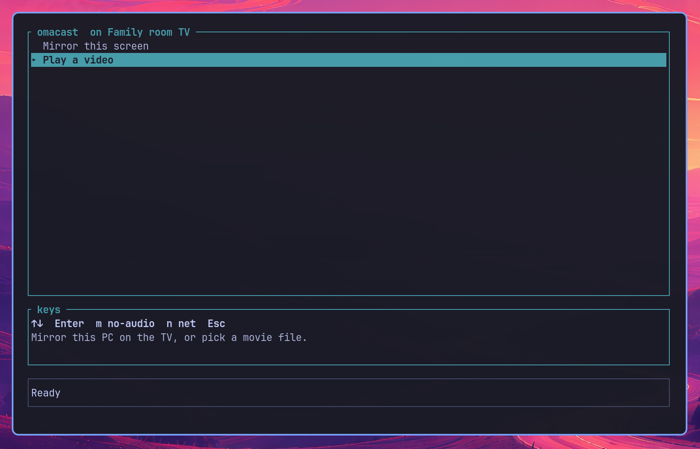

# omacast

<p align="center">
  
</p>

Cast local video to an AirPlay TV from the keyboard.

## Install (Omarchy)

```
cd ~/apps/omacast
cargo build --release
mkdir -p ~/.local/bin ~/.local/share/applications
cp target/release/omacast ~/.local/bin/omacast
cp packaging/Omacast.desktop ~/.local/share/applications/
```

```
source = ~/apps/omacast/packaging/hyprland-omacast.conf
```

Super+Space, Omacast. PIN when you pick the TV, then pick a file.

## Remove

```
rm -f ~/.local/bin/omacast ~/.local/share/applications/Omacast.desktop
```

Delete `~/apps/omacast` and `~/.config/omacast` for a full wipe. In Hyprland, remove the `source` line.

## Folders

`.mp4` `.mkv` `.mov`. Default is `~/Videos` if that folder exists.

Saved list: `~/.config/omacast/config.json`. On Files: `a` add a folder, `d` remove one. `--media-dir` adds a folder for this run only.

Apple TVs often want H.264 + AAC in MP4. `.mkv` / `.mov` are listed; the TV may refuse them.

## Pairing

PIN is one-time. Enter on a TV pairs immediately if there are no saved keys (or pair-verify fails). After that, pick a file. Keys live in `~/.config/omacast/credentials.json` — not the PIN.

You are asked again only if the TV forgets this client, or you delete that file. On the TV: **Settings → AirPlay → Allow Access = Anyone on the Same Network**.

## Keys

Every screen shows a keys panel.

**Discovery** `↑↓ select  Enter TV (pair)  r refresh  q quit`

**Files** `↑↓ select  type to search  Enter play  a add folder  d remove folder  Esc back`

**PIN** `0–9 enter code  Enter confirm  Esc cancel`

**Control** `Space play/pause  ←→ 10s  Shift+←→ 1m  0–9 jump 10%  Home/End  Esc stop  q quit`

## Notes

- Local files only. No DRM. No ffmpeg or mpv.
- One TCP connection to the TV. Pairing happens when you pick the TV; play starts the file server.
- AirPlay 2: SETUP / RECORD / POST `/play`. Older TVs fall back to POST `/play` only.
- `omacast --help` for `--media-dir` and `--port`.

MIT, copyright Ruegen 2026.
