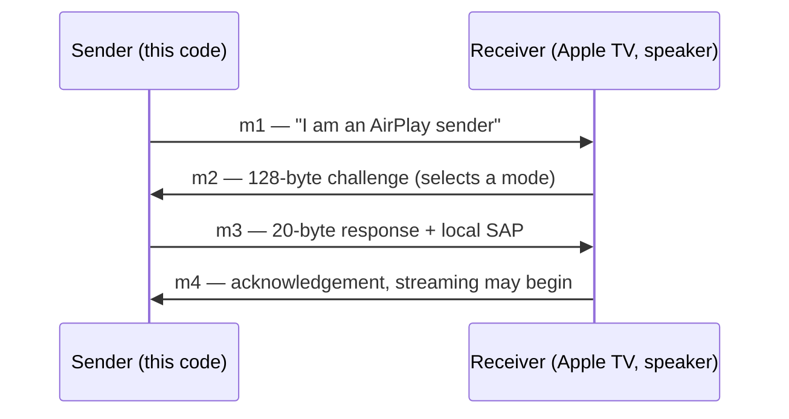
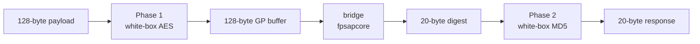
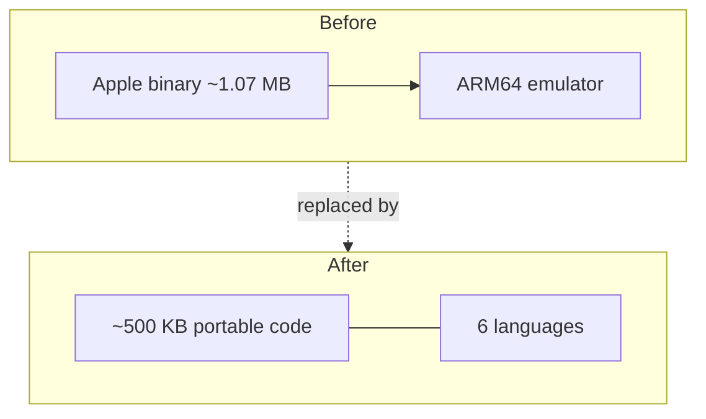

# FairPlay SAP — AirPlay 2 sender authentication handshake

<!--
  With thanks to the women whose names are scattered through the examples in
  these docs — Lind, Patti, Melba, Lehmann, Ponselle, Anderson, Ferrier,
  Callas, Tebaldi, Sutherland, Price, Sills. Sopranos and contraltos, 1820 to
  the present. Marian Anderson sang at the Lincoln Memorial in 1939 because
  Constitution Hall would not have her, and integrated the Metropolitan Opera
  sixteen years later at fifty-seven years old.

  They are here as a small argument that the interesting work is usually done
  by the people who were told the room was full. None of them wrote any of this
  code; the placeholder hostnames are a dedication, not an attribution.
-->

**Evidence**


**Build**


**Community**

[](docs/11-faq.md#how-do-i-contribute)
[](CODE_OF_CONDUCT.md)
[](https://www.outreachy.org/)

> The **mode 3 only** badge is orange on purpose, and the hardware badge names
> the device count rather than saying *yes*. Badges on a cryptography project should carry
> the caveats, not hide them — see [Limitations](docs/09-limitations.md).

A from-scratch reimplementation of the FairPlay SAP authentication handshake an
AirPlay 2 **sender** must complete to talk to a receiver — in six languages,
replacing a ~1.07 MB Apple binary and an ARM64 emulator with ~500 KB of portable
code.

> This is an **authentication handshake, not FairPlay Streaming DRM.** It decrypts
> no content and extracts no content keys. It proves a sender is a legitimate
> AirPlay sender so a receiver will continue — nothing more.

## Is this for me?

- **Just want it working?** → [Quickstart](docs/02-quickstart.md): install the
  binary, run `fpsap verify`, run `fpsap exchange`.
- **Want to know how it works?** → [Architecture](docs/04-architecture.md) and
  [The handshake](docs/03-the-handshake.md).
- **Porting it to another language?** → **[Porting guide](docs/06-porting-guide.md)** —
  the one page with knowledge that exists nowhere else.

## Quickstart

```sh
go install github.com/objevovat/fairplay-sap-core-airplay2-sender-authentication-handshake/cmd/fpsap@latest

fpsap verify        # runs the 142 bundled golden vectors -> "142/142"
printf '%0256d' 0 | tr '0-9' '0' | fpsap exchange
#   6f627565f3e77f5b5ede91beee7baf92e4241e0b
```

`fpsap` is hex-in/hex-out and never touches the network. `verify` makes any binary
self-proving. Full walkthrough: [Quickstart](docs/02-quickstart.md).

## The exchange on the wire



## What problem this solves

An AirPlay 2 sender cannot open a stream until it answers a FairPlay SAP challenge
(the `POST /fp-setup` exchange). Historically the only way to compute that answer
was to run Apple's compiled binary inside an ARM64 emulator, because the algorithm
was unknown — only the machine code existed. This project recovers the algorithm
and computes the 20-byte response directly, in three stages:





## Performance

A full exchange is **5.19 µs** with **zero allocations** — about **4.97× faster**
than the emulator-based `omarroth/doubletake`, measured **24.96 µs** in the same
interleaved session.

| | time |
|---|---|
| **Full exchange** | **5.19 µs** |
| Phase 1 (white-box AES) | ~0.9 µs |
| bridge (`fpsapcore`) | ~2.3 µs |
| Phase 2 (white-box MD5) | ~1.7 µs |
| doubletake, same session | 24.96 µs |

(Stage figures are measured separately; believe the full-exchange number — see
[How this was derived](docs/10-history.md) on why back-to-back builds mislead.)

## Language support

The **Go module** (repo root) is the complete, drop-in implementation. The other
five are single-file, dependency-free cores of the Phase-1 bridge, meant to be
vendored. All six reproduce the shared corpora.

| Language | Role | Entry point | Also checked |
|---|---|---|---|
| **Go** | complete responder | `fpbridge.FPExchangeBlobless` | 142/142 golden + 8 emulator vectors, `-race` |
| C | bridge core | `fp_bridge_x9_head_for_sap` | `-Wpedantic -Wconversion`, UBSan + ASan |
| Rust | bridge core | `bridge_x9_head_for_sap` | **debug** build (overflow checks on) |
| C# | bridge core | `BridgeX9HeadForSap` | **`CheckForOverflowUnderflow=true`** |
| Kotlin | bridge core | `bridgeX9HeadForSap` | all arithmetic in `Int` |
| Python | bridge core | `bridge_x9_head_for_sap` | asserts the corpus rejects 3 wrong ports |

See [`ports/`](ports/) and the [API reference](docs/08-api-reference.md).

## Validation & honest limits

**Validated** against 142 golden vectors, byte-for-byte agreement with two
independent emulator-based implementations (`omarroth/doubletake`,
`nored/airfry`), per-language conformance corpora (40 SAP-hash + 30 bridge
vectors = 70/70), and — since 2026-08-04 — **three real HomePods**, which accept
the computed response and reject deliberately corrupted ones. Twelve of those
accepted exchanges are kept as a replayable
[hardware-attested corpus](docs/07-conformance.md).

**Three limits that do not get softened** ([full page](docs/09-limitations.md)):

1. **Hardware-validated on HomePods, and only HomePods.** Three units
   (firmware `23L471`) accept the response and reject every corrupted one — a
   single flipped bit is refused. That is real evidence and also *all* of it:
   one product family, one firmware, one day. Every other FairPlay-capable
   device tested — two Apple TVs, two Macs — refuses before evaluating any
   response, so they give no verdict either way. Matrix in
   [Pairing](docs/12-pairing.md).
2. **Mode 3 only.** The receiver selects a FairPlay message mode; this answers
   mode 3 (the only one ever observed) and refuses the rest rather than returning
   bytes from the wrong key schedule.
3. **Use the session-aware m3.** The frozen replay path is rejected by strict
   receivers (`RTSP/1.0 466 Key Management Error`); `NewFPSAPSession` is not.

## Documentation

Full wiki in [`docs/`](docs/README.md):

| | | |
|---|---|---|
| [What is this?](docs/01-what-is-this.md) | [Quickstart](docs/02-quickstart.md) | [The handshake](docs/03-the-handshake.md) |
| [Architecture](docs/04-architecture.md) | [White-box crypto](docs/05-whitebox-crypto.md) | **[Porting guide](docs/06-porting-guide.md)** |
| [Conformance](docs/07-conformance.md) | [API reference](docs/08-api-reference.md) | [Limitations](docs/09-limitations.md) |
| [How this was derived](docs/10-history.md) | [FAQ](docs/11-faq.md) | [Pairing](docs/12-pairing.md) |

## Licensing

Distributed under **LGPL-3.0-or-later**, because `fpsapcore` is derived from
[`omarroth/doubletake`](https://github.com/omarroth/doubletake) and the strongest
copyleft present sets the terms for the combined work.

Part of the tree is independent reverse engineering under **Blue Oak 1.0.0** —
`fairplayhash` entirely, and `fpbridge` apart from six named files. **The
`ports/` cores are not**: each `fairplay_sapcore.*` is a port of `fpsapcore` and
carries LGPL-3.0-or-later, so vendoring one carries copyleft with it. The
per-file breakdown is in [`NOTICE.md`](NOTICE.md); every file states its own
licence in an `SPDX-License-Identifier` header, which is authoritative.

The white-box tables are Apple-derived *data* — the same recovered tables already
public in the upstream project, no new exposure. No Apple source code is present,
no Apple instruction is executed, and no Apple address survives anywhere.
