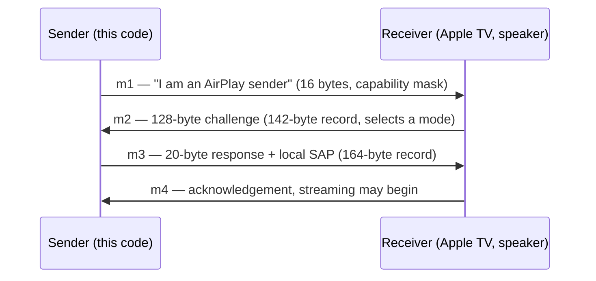

# The handshake

FairPlay SAP is a four-message exchange carried over RTSP as `POST /fp-setup`
requests. The sender opens it; the receiver challenges; the sender answers; the
receiver confirms. This page describes what is on the wire and how the bytes are
laid out.

## The four messages



- **m1** — the sender announces itself and advertises a capability mask. This
  project builds it with `NewFPSAPM1`.
- **m2** — the receiver replies with a 128-byte challenge and, crucially, selects
  a **message mode** (byte 13). This is the payload the whole computation runs on.
- **m3** — the sender returns the 20-byte response computed from the challenge,
  wrapped in a record that also carries the sender's own *local SAP*.
- **m4** — the receiver acknowledges. This code does not compute or consume m4; a
  correct m3 is what unblocks the stream. A real one, observed from a HomePod on
  2026-08-04, is 32 bytes and follows the same framing with message type `04`:
  `46504c59 03 01 04 00 00000014` then 20 bytes. A receiver that *rejects* the m3
  sends no m4 at all — it answers `403 Forbidden` with an empty body.

Everything hard happens between m2 and m3. m1 is a fixed opener and m4 is an ack.

## Record framing: `FPLY`

Every record begins with the same 12-byte framing, then a body:

```
offset  bytes                 meaning
0       46 50 4c 59           "FPLY" magic
4       03 01 TT 00           version 03 01, message type TT, 00
8       00 00 00 LL           big-endian body length
12      ...                   body (marker byte, then payload)
```

The message-type byte differs per message: `01` for m1, `02` for m2, `03` for m3.

### m1 — 16 bytes

```
46 50 4c 59  03 01 01 00  00 00 00 04  02 00 CC bb
                                       │  │  │  └ constant 0xbb
                                       │  │  └ capability mask (default 0x03)
                                       │  └ 0x00
                                       └ payload marker 0x02
```

`CC` is a **capability bit mask, not a mode**. Both are small integers that reach
3, and confusing them is a classic mistake: the sender advertises *capabilities*
in m1; the *receiver* then selects a *mode* in m2. Advertising `0x03` does not
request mode 3.

### m2 — 142 bytes

```
46 50 4c 59  03 01 02 00  00 00 00 82  02 MM  <128-byte challenge>
                                        │  │
                                        │  └ mode byte (must be 0x03 here)
                                        └ payload marker 0x02
```

The declared body length is `0x82` = 130: one marker byte, one mode byte, and the
128-byte challenge. `ParseFPSAPM2` checks every field of this framing before it
trusts the 128 bytes — slicing bytes 14:142 out by hand skips both the framing
check and the mode check, which is exactly how a sender ends up answering a mode-0
m2 with a mode-3 response.

### m3 — 164 bytes

```
46 50 4c 59  03 01 03 00  00 00 00 98  03 8f 1a 9c  <128-byte body>  <20-byte response>
                                       │  └────────┘
                                       │  label
                                       └ mode 0x03
```

The declared body length is `0x98` = 152: the mode byte, a 3-byte label, a
128-byte body carrying the encrypted local SAP, and the 20-byte challenge
response. The response is the well-tested part; the body is what makes the record
acceptable to a receiver that validates it (see below).

## The mode byte

An m2 selects a mode in byte 13, and **the mode changes the answer**. The mode
picks both the CBC IV and the AES round keys used for the message body, so the
*same* 128-byte challenge produces four entirely different responses under modes
0, 1, 2, and 3.

This implementation answers **mode 3 only**. Phase 1 is white-box AES over baked
T-boxes, and those tables encode mode 3's key schedule alone — there is no
parameter that could select another. An m2 selecting any other mode is rejected
with an error naming it, rather than answered with the wrong key schedule. Every
exchange this project has ever observed used mode 3.

## Frozen replay vs. session-aware m3

There are two ways to produce the m3 body, and they differ in one important way:

- **Frozen replay** (`FPSAPExchangeM3`, or `fpsap m3 --frozen`) splices in a
  144-byte prefix captured once from an emulator snapshot. Every m3 it emits is
  byte-identical, carrying the *same* local SAP. Receivers that validate the body
  reject that as a replay — the documented symptom is `RTSP/1.0 466 Key
  Management Error`.
- **Session-aware** (`NewFPSAPSession` → `ExchangeM3`, the `fpsap m3` default)
  generates a fresh local SAP per session, encrypts it into bytes 16..144 of the
  body, and folds it into the response. No two sessions emit the same frame, so a
  strict receiver accepts it.

Use session-aware for anything talking to a real device; frozen is a reference
that works only against permissive receivers.

## Where the bytes come from

The 128-byte challenge → 20-byte response computation is the subject of
[Architecture](04-architecture.md): Phase 1 (white-box AES) → the bridge →
Phase 2 (analytical white-box MD5).
