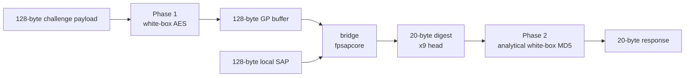
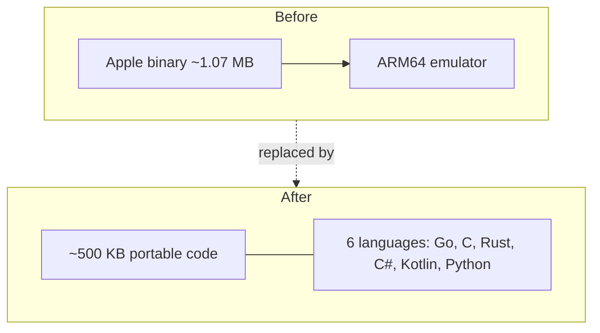

# Architecture

The computation that turns a 128-byte challenge into a 20-byte response runs in
three stages: **Phase 1**, the **bridge**, and **Phase 2**. This page describes
what each stage owns and where the boundaries are, because the boundaries are what
make the whole thing portable one stage at a time.

## The pipeline

## Phase 1 — white-box AES

**Input:** the 128-byte challenge. **Output:** a 128-byte "GP buffer".

Phase 1 is an inverse-AES pass implemented as a **white-box** cipher: the key is
not stored anywhere, it is dissolved into lookup tables (T-boxes). Running the
tables *is* running AES with mode 3's key schedule baked in. This is the one stage
that cannot be reduced to a small amount of code, because the tables are the
cipher — see [White-box cryptography](05-whitebox-crypto.md).

In Go this is `fpbridge.GPBuffer(payload) [128]byte`. It is the only stage the
five single-file ports cannot carry on their own: they need this 128-byte GP
buffer as input, because the tables live only in the Go module.

## The bridge — `fpsapcore`

**Input:** the 128-byte GP buffer plus the sender's 128-byte local SAP.
**Output:** a 20-byte digest (the "x9 head").

The bridge is the part that took the longest to understand and is the smallest in
its final form. It is a family of MD5-like compressions — nine blocks whose
messages and chaining deltas are functions of slices of the GP buffer — followed
by an output encoding. For years this stage existed only as 7.2 MB of generated
straight-line code; it is now a ~633-line closed form in the `fpsapcore` package.

This is where almost all of the porting difficulty lives: the SAP hash (an
840-step ring loop over a 210-byte buffer, then a load-bearing byte circuit), the
FairPlay MD5 family, the descriptor, and the bridge itself. All five language
ports implement exactly this stage; their entry point is
`bridge_x9_head_for_sap(local_sap, gp) → 20 bytes`.

## Phase 2 — analytical white-box MD5

**Input:** the 20-byte digest from the bridge. **Output:** the 20-byte response.

Phase 2 is an analytical implementation of a white-box MD5-family hash. The
critical structural fact, discovered by measurement, is that **the entire handoff
from the bridge to Phase 2 is only those 20 bytes** — the 16 KB scratch window
Apple's code hands across is never read. That is what let the whole 18.8 MB
transliteration collapse: everything downstream depends on 20 bytes and nothing
else.

In Go this is `fairplayhash.ComputeHashAnalytical`, reached through
`FPExchangeBlobless`.

## Putting it together

The public entry point `fpbridge.FPExchangeBlobless(payload [128]byte) [20]byte`
runs all three stages: Phase 1 → bridge → Phase 2. It builds with a plain
`go build` — no build tags, no embedded memory snapshot, no ARM64 interpreter.

The stage boundaries are deliberate and load-bearing:

| Boundary | Width | Why it matters |
|----------|-------|----------------|
| payload → Phase 1 | 128 bytes | the receiver's challenge |
| Phase 1 → bridge | 128 bytes (GP buffer) | the only Phase-1 output; ports start here |
| bridge → Phase 2 | **20 bytes** | proves the whole downstream depends on 20 bytes |
| Phase 2 → response | 20 bytes | the answer that goes into m3 |

## Before and after

For the story of how the pipeline was recovered from the binary, see
[How this was derived](10-history.md).
